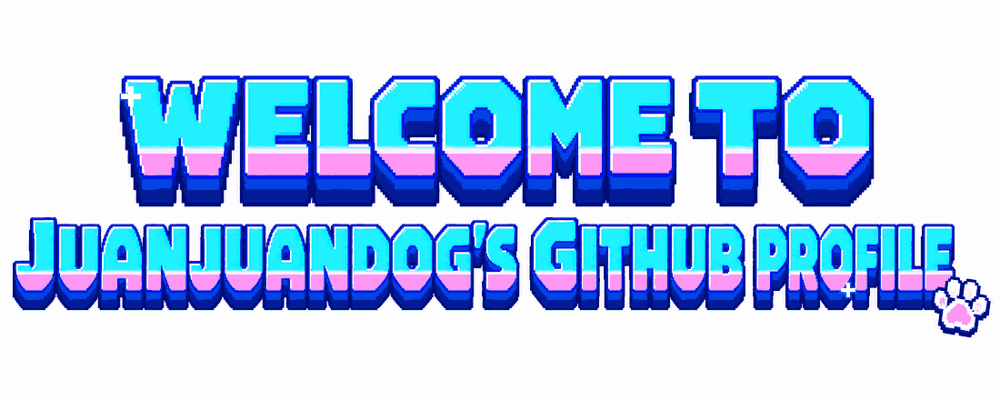
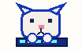
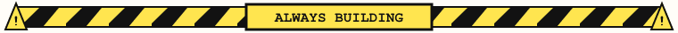
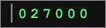
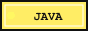
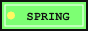
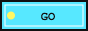
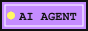
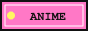
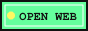

  
   
   

**i love code**&nbsp;&nbsp;&nbsp;&nbsp;**and anime**&nbsp;&nbsp;

 

 

你好，我是 **卷卷狗**。Backend-focused full-stack developer.

currently: coding, building, debugging, shipping 

dream: 每天都能看动漫和 coding 

`idea → design → code → debug → ship`

 
 

 

  <strong>人的梦想是不会结束的！</strong>
   
  慢慢写，慢慢变强。

